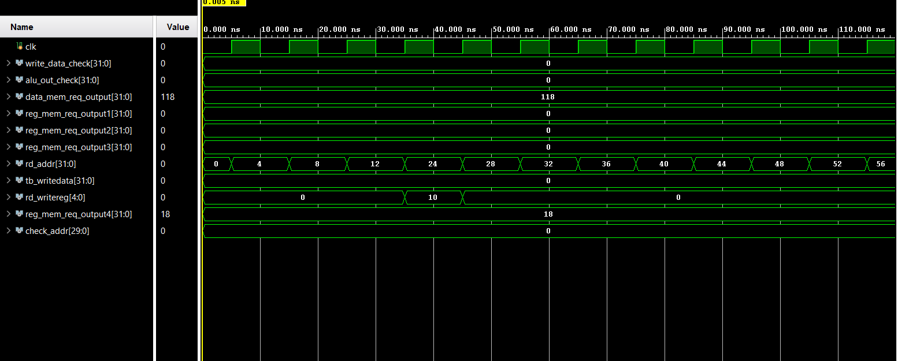
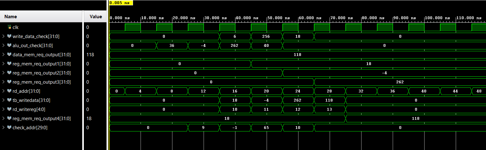
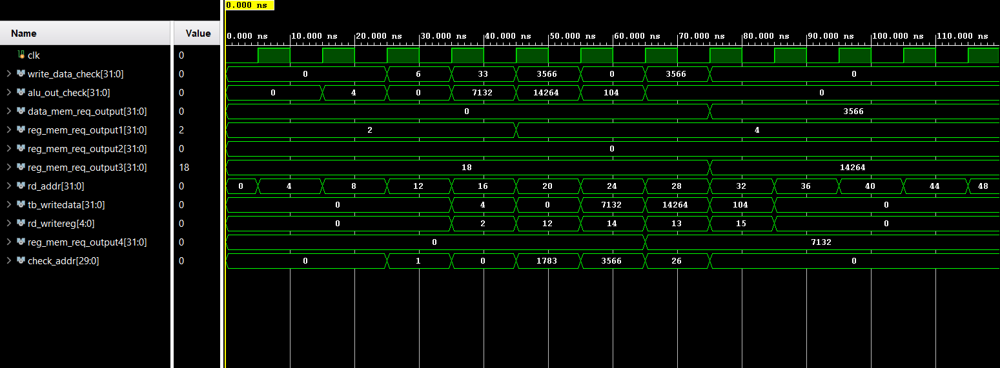

# MIPS 32-bit 5-Stage Pipelined Processor

This project is a 32-bit MIPS-based processor built using Verilog. It implements a 5-stage pipeline: **IF, ID, EX, MEM, WB**. It also includes support for **forwarding**, **branch**, and **jump** instructions.

---

## 🚀 Features

- 5-stage pipelined datapath
- Supports ALU operations, memory access, branching, and jumping
- Implements **data hazard resolution** via a forwarding unit
- Testbench with multiple instruction sequences
- Waveform verification using GTKWave/ModelSim

---

## 🧩 Files

- `top.v` – Main integration module
- `ALU_Unit.v`, `alu_control.v`, `control_unit.v` – Core logic
- `EXMEM_reg.v`, `IDEX.v`, `IFID_reg.v`, `MEMWB.v` – Pipeline registers
- `data_mem.v`, `ins_mem.v`, `registers.v` – Memories and register file
- `forwarding_unit.v` – Data hazard detection and forwarding
- `testbench.v` – Sample program for testing processor behavior

---

## 🖼️ Images

### 🔧 Pipelined Datapath

### ➿ Forwarding Unit

### 📊 Sample Waveform 1

### 📊 Sample Waveform 2

### 📊 Sample Waveform 3

---

## 🧪 Testing

The processor has been tested with arithmetic, memory, and control instructions. Simulation waveforms verify forwarding and hazard handling.

---

## 📂 Folder Structure

